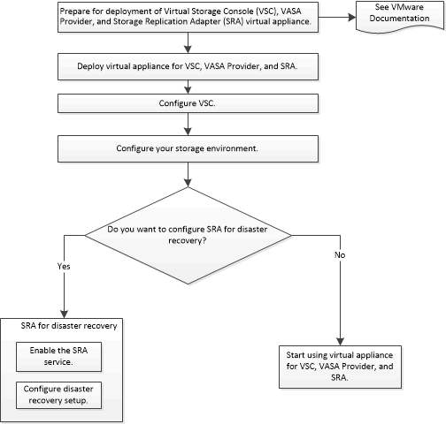

= VSC, VASA Provider, SRA 가상 어플라이언스 신규 사용자를 위한 구축 워크플로우
:allow-uri-read: 
:icons: font
:imagesdir: ../media/

[role="lead"]
VMware를 처음 사용하는 경우 NetApp VSC 제품을 사용하지 않은 경우, VSC, VASA 공급자, SRA를 위한 가상 어플라이언스를 구축 및 구성하기 전에 vCenter Server를 구성하고 ESXi 호스트를 설정해야 합니다.

